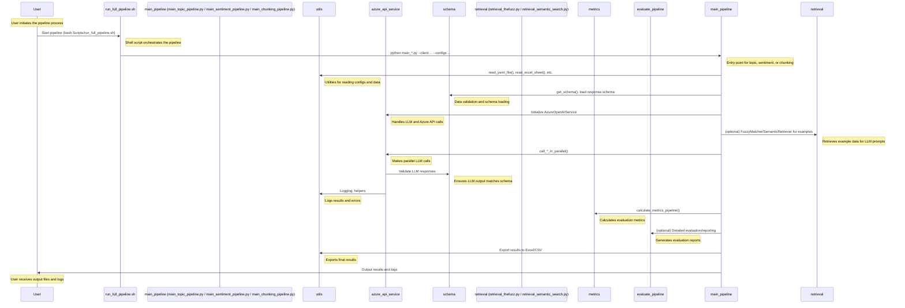

# ML Engineering on Google Cloud Platform

This repository maintains hands-on labs and code samples that demonstrate best practices and patterns for implementing and operationalizing production grade machine learning workflows on Google Cloud Platform. 

## Navigating this repository
This repository is organized into two sections:
- [Mini workshops](./workshops/)
- [Code samples](./examples/)

### Mini workshops
This section contains hands-on labs for instructor led ML Engineering mini workshops. 

### Code Samples
This section compiles  samples demonstrating design and code patterns for a variety of ML Engineering topics. 

#### Sequence Diagram

 

